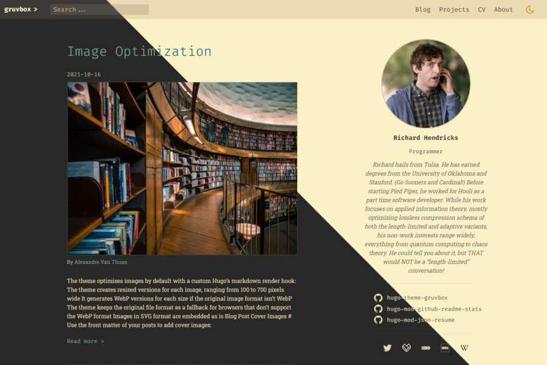
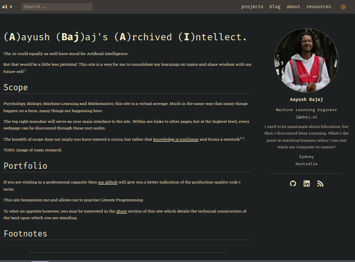

# Gruvbox Hugo Theme

A retro-looking theme created by [Michael Schnerring](https://github.com/schnerring) and stolen by me.

Mr. Schnerring has created the site to be navigable (via [Flex Search](https://github.com/nextapps-de/flexsearch) and optimised both for images and Search Engines! He has also programmed in a light-dark mode toggle which delights me.

I write all the content for the site using org files in Emacs, but the theme leverages [Hugo's](https://gohugo.io) shortcodes and wizardry to create such a consistent and fast frontend.

I have modified the `css` and `/partials` folder from the original [repository](https://github.com/schnerring/hugo-theme-gruvbox), so I highly suggest `git clone`ing that one to begin with and then referencing this repo should you feel inclined to.
